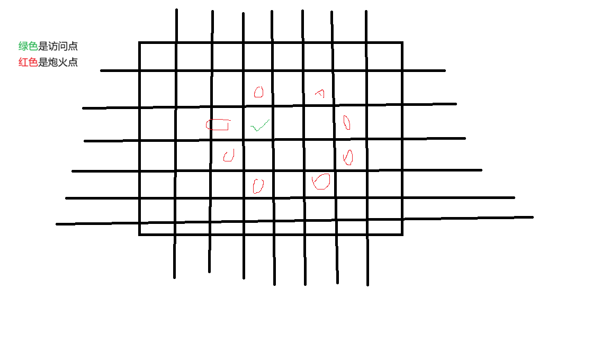

# <span style="color:red">这是一级标题 </span>
## <span style="color:rgb(200, 100, 0)">这是二级标题</span> 
# <span style="color:red">这是一级标题 </span>
## <span style="color:rgb(200, 100, 0)">字体</span> 
### <span style="color:rgb(100,200,0)">粗体</span>
(`**粗体**或者__粗体__`)**粗体** 或者 __粗体__ (两个下划线)
### <span style="color:rgb(100,200,0)">斜体</span>
(`*斜体*或者_斜体_`)*斜体* 或者 _斜体_(单下划线)
### <span style="color:rgb(100,200,0)">删除线</span>
(`~~字~~`)~~删除线~~
## <span style="color:rgb(200, 100, 0)">列表</span> 
### <span style="color:rgb(100,200,0)">无序列表</span>
(`- 项目或者 * 项目 或者 + 项目`)
- 线段树
* 树状数组
+ 字典树
### <span style="color:rgb(100,200,0)">有序列表</span>
(`1.`)
1. 欧几里得
2. 扩展欧几里得
3. 解决同余方程
4. 欧拉函数
## <span style="color:rgb(200, 100, 0)">代码区</span> 
### <span style="color:rgb(100,200,0)">行内代码</span>
(` `` `, 内部放代码)
`int a = 1`
### <span style="color:rgb(100,200,0)">代码块</span>
(` ``` ``` `, 内部放代码)
```cpp
#include<bits/stdc++.h>
using namespace std;
int main {
    cout << "i`m a king." << endl;
    return 0;
}
```
## <span style="color:rgb(200, 100, 0)">引用</span> 
(`>, >> , >>> `)
> 这是引用内容，用来强调或者啥的
>> look
>>> looklook
>>>> looklooklook
## <span style="color:rgb(200, 100, 0)">链接与图片</span> 
### <span style="color:rgb(100,200,0)">链接</span>
(`[链接文本](https://example.com)`)

[何意味](https://github.com/hky2023/algorithm-learning-summary)

### <span style="color:rgb(100,200,0)">图片链接</span>

## <span style="color:rgb(200, 100, 0)">分割线</span> 
(` --- `)

hyw
---
何意味

## <span style="color:rgb(200, 100, 0)">表格</span> 

```
|列1 | 列2|
|---| --- |
|内容|内容|
```
|列1 | 列2|
|---| --- |
|内容|内容|

## <span style="color:rgb(200, 100, 0)">数学公式</span>

### <span style="color:rgb(100,200,0)">行内公式</span>
(`$ $`)

(`$a^2+b^2=c^2$`)$a^2+b^2=c^2$
()

### <span style="color:rgb(100,200,0)">块级公式</span>
(` $$ $$ `)

(`$$\sum_{i=1}^n i = \frac{n(n+1)}{2}$$`)
$$
\sum_{i=1}^n i = \frac{n(n+1)}{2}
$$
(`$$\prod_{i=1}^n i = n!$$`)
$$
\prod_{i=1}^n i = n!
$$
(`$$(a+b)^n = \sum_{k=0}^n \binom{n}{k} a^{n-kb^k$$`)
$$
(a+b)^n = \sum_{k=0}^n \binom{n}{k} a^{n-k}b^k
$$
(`$$\binom{n}{k} = \frac{n!}{k!(n-k)!}$$`)

$$
\binom{n}{k} = \frac{n!}{k!(n-k)!}
$$
(`$$f(n) = f(n-1) + f(n-2)$$`)
$$
f(n) = f(n-1) + f(n-2)
$$
(`$$\gcd(a, b)$$$$\mathrm{lcm}(a, b)$$`)
$$
\gcd(a, b)
$$

$$
\mathrm{lcm}(a, b)
$$
(`$$n = \prod_{i=1}^k p_i^{a_i}$$`)
$$
n = \prod_{i=1}^k p_i^{a_i}
$$
(`$$E[X] = \sum_{i=1}^n x_i p_i$$`)
$$
E[X] = \sum_{i=1}^n x_i p_i
$$
(`$$|A \cup B| = |A| + |B| - |A \cap B|$$`)
$$
|A \cup B| = |A| + |B| - |A \cap B|
$$

## <span style="color:rgb(200, 100, 0)">生成目录</span>
(`[TOC]`)

[TOC]


